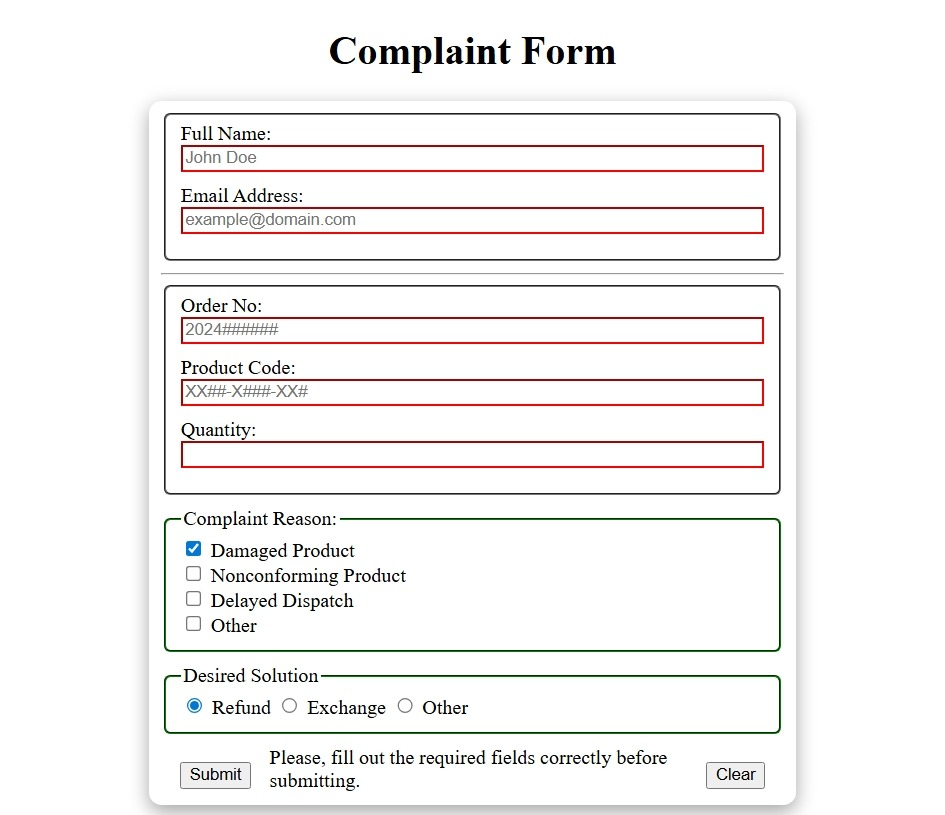

# Customer Complaint Form

An interactive JavaScript web app that allows users to submit complaints through a structured form. This project demonstrates form validation, DOM manipulation, responsive design, and modular JavaScript logic.

---

## 🚀 Live Demo

[View Project](https://himanshu-kumar-2301.github.io/fcc-js-complaint-form/)

---

## 🛠️ Tech Stack

- HTML5
- CSS3
- JavaScript (ES6+)

---

## 📸 Screenshots



---

## 📚 Features

- **Structured complaint form**: Collects user details, complaint type, and description.
- **Form validation**: Ensures required fields are filled and input formats are correct.
- **Interactive UI**: Provides instant feedback for invalid inputs.
- **Responsive design**: Works seamlessly across desktop and mobile browsers.
- **Modular JavaScript**: Clean separation of logic for readability and scalability.

---

## 📂 Project Structure

```code
root/  
|--index.html  
|--style.css  
|--script.js  
└--assets/  
     └--images/  
```

---

## 🧑‍💻 How to Run Locally

1. Clone the repo:

    ```bash
    git clone https://github.com/Himanshu-Kumar-2301/fcc-js-complaint-form.git
    ```

2. Navigate into the folder

    ```bash
    cd fcc-js-complaint-form
    ```

3. Open ```index.html``` in your browser.

## 📌 Future Improvements

- Add persistent storage (localStorage or backend integration).
- Improve accessibility with ARIA labels and keyboard navigation.
- Add confirmation messages or email notifications.
- Enhance mobile responsiveness with better layout adjustments.

## ℹ️ About

This project is part of the **FreeCodeCamp JavaScript curriculum** and highlights skills in **form handling, validation, and interactive UI design**. It serves as a practical example of building user‑friendly forms for real‑world applications.
